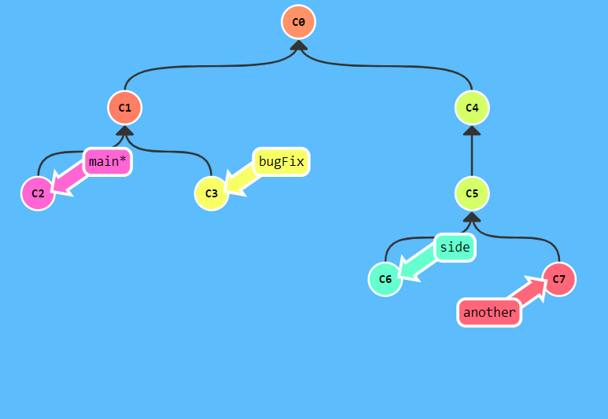

# Git学习笔记

Git是用c语言写的，Git是分布式版本控制系统。

Git会clone，pull push,建分支branch，合并，暂存，commit，rollback，merge

### 本地电脑git设置

签名 

```
$ git config  --global user.name Wzh
$ git config  --global user.email tomatooi@qq.com  
```

安装路径E:\software\Git

git仓库路径E:\Git-Space

### 本地篇

#### 创建一个Git目录仓库

```
先cd选择一个合适的目录(Windows系统，目录名（包括父目录）不包含中文。)
$git init 将该目录变成Git仓库
$git status查看本地库状态
$git reflog 查看历史记录

$git log 完整版本号
$git reflog 前七位版本号

esc退出编写  yy复制 p粘贴
```

#### git log

$git log 完整版本号
$git reflog 前七位版本号


#### 文件添加与提交

```
$git add 把文件添加到仓库

$git commit 把文件提交到仓库(commit可以一次提交多个文件)

$git commit -m <本次提交的说明>

$git status 查看当前仓库情况
	$git diff 查看具体修改了什么
	git diff HEAD -- <n>命令可以查看工作区和版本库里面最新版本的区别：
```

#### 修改文件名

$ git mv 原文件名 新文件名

```
git mv hello.txt he.txt
```


#### 文件删除

git rm 用于删除文件，已经提交到版本库的不用担心误删。

```
git rm删掉，并且git commit
```


#### 分支操作

```
*号表示当前分支
$git branch 列出所有分支
$git branch <n>创建新分支	
$git branch -d <n>删除某分支 -D 强制删除
$git checkout <n>切换到某个分支(git switch <name>高版本)

$git checkout -b <n> -b参数表示创建并切换
git checkout -- file可以丢弃工作区的修改
让这个文件回到最近一次git commit或git add时的状态。

$git switch -c <name> -c

$git merge <n> 合并某分支到当前分支

$git merge --no-ff <n> 合并某分支到当前分支
普通模式合并，合并后的历史有分支，能看出来曾经做过合并，

$ git stash 保存当前先把工作现场
$ git stash list 查看保存的工作现场
$ git stash apply

恢复，但是恢复后，stash内容并不删除，你需要用git stash drop来删除；
$ git stash pop
恢复并删除
在master分支上修复的bug，想要合并到当前dev分支，可以用git cherry-pick <commit>命令，把bug提交的修改“复制”到当前分支，避免重复劳动。
```

##### Rebase <n>

- rebase操作可以把本地未push的分叉提交历史整理成直线；
- rebase的目的是使得我们在查看历史提交的变化时更容易，因为分叉的提交需要三方对比。
- Rebase 使你的提交树变得很干净, 所有的提交都在一条线上
- 缺点:
  - Rebase 修改了提交树的历史

#### Feature分支(实验分支)

每添加一个新功能，最好新建一个feature分支，在上面开发，完成后，合并，最后，删除该feature分支。

```
$ git switch -c feature-vulcan
$ git add <>
$ git commit -m ""
$ git switch dev
$ git merge feature-vulcan
$ git branch -D feature-vulcan (没有合并需要大写D强制删除)
```

#### 多人协作

- `master`分支是主分支，因此要时刻与远程同步；
- `dev`分支是开发分支，团队所有成员都需要在上面工作，所以也需要与远程同步；
- bug分支只用于在本地修复bug，就没必要推到远程了，除非老板要看看你每周到底修复了几个bug；
- feature分支是否推到远程，取决于你是否和你的小伙伴合作在上面开发。

```
$ git remote 查看远程库的信息
$ git remote -v 更详细的信息
本地新建的分支如果不推送到远程，对其他人就是不可见的；

从本地推送分支，使用git push origin branch-name，如果推送失败，先用git pull抓取远程的新提交；

在本地创建和远程分支对应的分支，使用git checkout -b branch-name origin/branch-name，本地和远程分支的名称最好一致；

建立本地分支和远程分支的关联，使用git branch --set-upstream branch-name origin/branch-name；

从远程抓取分支，使用git pull，如果有冲突，要先处理冲突。
```

#### 相对引用

^ 向上移动一次

~指定向上移动多少次

->

```
$ git checkout HEAD^ 

$ git branch -f main c6

$ git branch -f bugFix HEAD^
```

#### 撤销变更

reset 本地

revert 远程分支

```
git reset HEAD~
git revert HEAD
```

#### 版本回退

Git允许我们在版本的历史之间穿梭，使用命令git reset --hard commit_id

#### 整理提交记录

- git cherry-pick <提交号> 将一些提交复制到当前所在的位置（`HEAD`）下面


```
git cherry-pick c3 c4 c7
```

#### 交互式的 rebase

交互式 rebase 指的是使用带参数 `--interactive` 的 rebase 命令, 简写为 `-i`

当 rebase UI界面打开时, 你能做3件事:

- 调整提交记录的顺序（通过鼠标拖放来完成）
- 删除你不想要的提交（通过切换 `pick` 的状态来完成，关闭就意味着你不想要这个提交记录）
- 合并提交。 遗憾的是由于某种逻辑的原因，我们的课程不支持此功能，因此我不会详细介绍这个操作。简而言之，它允许你把多个提交记录合并成一个。

git rebase -i HEAD~

#### 提交的技巧 #1

- 先用 `git rebase -i` 将提交重新排序，然后把我们想要修改的提交记录挪到最前
- 然后用 `git commit --amend` 来进行一些小修改
- 接着再用 `git rebase -i` 来将他们调回原来的顺序
- 最后我们把 main 移到修改的最前端（用你自己喜欢的方法），就大功告成啦！


```
$ git rebase -i HEAD~2
$ git commit --amend
$ git rebase -i HEAD~2
$ git branch -f main c3''
```

#### 提交的技巧 #2

cherry-pick 可以将提交树上任何地方的提交记录取过来追加到 HEAD 上（只要不是 HEAD 上游的提交就没问题）。


```
git checkout main 切换到main分支
git cherry-pick c2  将c2复制到当前所在的位置（`HEAD`）下面
git commit --amend 修改c2'->c2''
git cherry-pick c3 将c3复制到当前所在的位置（`HEAD`）下面
```

#### Git Tags(标签)

永久地将某个特定的提交命名为里程碑，然后就可以像分支一样引用了.


```
git tag v1 c1 命名v1标签，并且明确地让它指向提交记录 C1
```


```
git tag v0 c1 在c1提交点建v0标签
git tag v1 c2 在c2提交点建v1标签
git checkout v1 checkoutv1标签会进到分离 HEAD 的状态 —— 这是因为不能直接在v1 上面做 commit。
```

#### Git Describe(描述最近的锚点)

`git describe` 的语法是：

```
git describe <ref>
```

`<ref>` 可以是任何能被 Git 识别成提交记录的引用，如果你没有指定的话，Git 会以你目前所检出的位置（`HEAD`）。

它输出的结果是这样的：

```
<tag>_<numCommits>_g<hash>
```

`tag` 表示的是离 `ref` 最近的标签， `numCommits` 是表示这个 `ref` 与 `tag` 相差有多少个提交记录， `hash` 表示的是你所给定的 `ref` 所表示的提交记录哈希值的前几位。

当 `ref` 提交记录上有某个标签时，则只输出标签名称

#### 多次Rebase




```
git rebase main bugFix 
git rebase bugFix side //直接把siderebase到bugFix上可以同时线性提交c4 c5 c6
git rebase side another //这一步也是一样的
git branch -f main c7'
```

#### 选择父提交记录

`^` 与 `~` 符一样，后面也可以跟一个数字。

Git 默认选择合并提交的“第一个”父提交，在操作符 `^` 后跟一个数字可以改变这一默认行为。

操作符还支持链式操作！试一下这个：

git checkout HEAD~^2~2


```
$ git checkout HEAD~^2~
$ git branch$ git branch bugWork 在c2上创建bugWor分支
$ git checkout main 切换到main
```


#### 纠缠不清的分支

-------

```
$ git checkout one

$ git cherry-pick c4 c3 c2

$ git checkout two

$ git cherry-pick c5 c4' c3' c2'

$ git branch -f three c2
```

### 远程篇

#### git clone(创建一个远程仓库的拷贝)

`git clone` 命令在真实的环境下的作用是在**本地**创建一个远程仓库的拷贝。

#### Git Fetch(从远程仓库获取数据)

git fetch 做了些什么

`git fetch` 完成了仅有的但是很重要的两步:

- 从远程仓库下载本地仓库中缺失的提交记录
- 更新远程分支指针(如 `o/main`)

`git fetch` 实际上将本地仓库中的远程分支更新成了远程仓库相应分支最新的状态。

如果你还记得上一节课程中我们说过的，远程分支反映了远程仓库在你**最后一次与它通信时**的状态，`git fetch` 就是你与远程仓库通信的方式了！希望我说的够明白了，你已经了解 `git fetch` 与远程分支之间的关系了吧。

`git fetch` 通常通过互联网（使用 `http://` 或 `git://` 协议) 与远程仓库通信。

注：`git fetch` 理解为单纯的下载操作。

不会改变本地仓库的状态。它不会更新你的 `main` 分支，也不会修改你磁盘上的文件。

#### Git Pull

`git pull`从远程仓库下载更新内容，并立即将对应内容更新到本地仓库。

`git pull`命令实际上就是其他两个命令的结合体

先`git fetch`然后紧接着`git merge`

在`git pull`命令执行的第一个阶段，会先对当前本地HEAD指针指向的分支执行`git fetch`。当原称更新内容下载完成之后，`git pull`会接着进入合并流程。合并操作会创建一个新的commit，并且HEAD指针也会随之更新而指向这个新的commit。

#### 模拟团队合作


```
$ git clone 克隆远程仓库

$ git fakeTeamwork 模拟同事提交

$ git fakeTeamwork 模拟同事提交

$ git commit 本地提交

$ git pull 取远程仓库的变更
```

#### Git Push

推送自己的修改，并在远程仓库上合并新提交记录

#### 偏离的提交历史

使工作基于最新的远程分支。

```
方法一 先拉取 再rebase移动到最新的提交记录 最后git push推送
$ git fetch
$ git rebase o/main
$ git push

方法二 先拉取 再merge合并新变更到我们的本地分支（为了包含远程仓库的变更） 最后git push推送
$ git fetch
$ git merge o/main
$ git push

方法三 简写命令 git pull --rebase 就是 fetch 和 rebase 的简写！
$ git pull --rebase
$ git push
```

#### *锁定的Main(Locked Main)*


```
$ git reset --hard o/main  版本回退

$ git checkout -b feature c2 在c2创建分支并切换过去

$ git push origin feature 推送到远程仓库
```

#### 推送主分支


```
$ git fetch 先获取数据

$ git rebase o/main side1

$ git rebase side1 side2

$ git rebase side2 side3

$ git rebase side3 main

$ git push 推送远程仓库
```

#### 合并远程仓库


```
$ git checkout main

$ git pull

$ git merge side1

$ git merge side2

$ git merge side3

$ git push
```

#### 远程跟踪

- pull 操作时, 提交记录会被先下载到 o/main 上，之后再合并到本地的 main 分支。隐含的合并目标由这个关联确定的。

- push 操作时, 我们把工作从 `main` 推到远程仓库中的 `main` 分支(同时会更新远程分支 `o/main`) 。这个推送的目的地也是由这种关联确定的！

  自己指定这个属性

  ```
  方法一
  git checkout -b totallyNotMain o/main
  就可以创建一个名为 `totallyNotMain` 的分支，它跟踪远程分支 `o/main`。
  方法二
  git branch -u 命令，执行：
  git branch -u o/main foo
  这样 foo 就会跟踪 o/main 了。如果当前就在 foo 分支上, 还可以省略 foo：
  git branch -u o/main
  ```


```
git checkout -b side o/main

git commit

git pull --rebase

git push
```

#### Git push的参数

git push <remote> <place>

例子： git oush origin main

*切到本地仓库中的“main”分支，获取所有的提交，再到远程仓库“origin”中找到“main”分支，将远程仓库中没有的提交记录都添加上去，搞定之后告诉我。*

​	提交记录来自本地main  推送到远程仓库的main

### **常用命令**


```
 git init
 git add
 git commit
 	git commit -m 
 	git commit --amend
 	
 git status 查看状态
     git diff查看具体修改内容
     
 git log 
 git reflog
 git log --graph 分支合并图
 
 git rm 文件名  删除文件
 git checkout -- 文件名
 
 git branch 
 	git branch -d -D 大D强制删除
 	git branch -f <> <>
 git checkout 
    git checkout -b <n>
 git switch
 	git switch -c <n>
 git merge <n>
 	git merge --no-ff <n>
 git stash
 	git stash list
 	git stash apply
 	git stash drop
 	git stash pop
 git cherry-pick <commit>
在合并bug修复内容之前，dev分支之前的修改应继续stash，而不要恢复。
 
 git tag v1 c1(标签不会自动推到远程)
 	git tag -d v1 本地删除 
 	git Describe 描述最近的锚点
 	
 	git push origin <tagname> 推到远程
 	git push origin :refs/tags/<>tagname
 
 
 Rebase
 git rebase
 	git rebase -i HEAD视图
 
```

#### 远程

```
$ ssh-keygen -t rsa -C "youremail@example.com"	//创建SSH Key
$ git remote add origin git@github.com:Daisy/AKgit.git	//关联
$ git push -u origin master	//将本地内容推送到远程仓库（第一次）
$ git push origin master	//将本地内容推送到远程仓库（之后）
$ git remote -v        //查看远程仓库信息
$ git remote rm origin	//删除远程仓库（解绑）
$ git clone git@github.com: Daisy/AKgit.git	//克隆远程仓库
//克隆之后使用和查看
$ cd gitskills
$ ls
$ git remote	//查看远程库的信息
$ git remote -v	//查看远程库的详细信息
```

