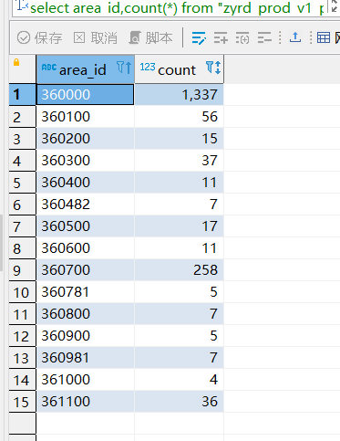
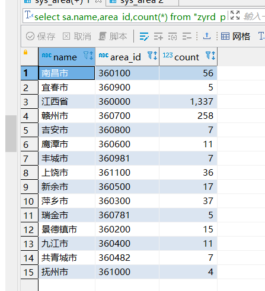

### 分组查询

```sql
select area_id,count(*) from "zyrd_prod_v1_platform_jiangxi_qianyi"."sys_login_log" WHERE login_time > '1669823999000' GROUP BY area_id ;
```



sys_login_log与sys_area联合查询

```sql
select sa.name,area_id,count(*) from "zyrd_prod_v1_platform_jiangxi_qianyi"."sys_login_log" sl,"zyrd_prod_v1_platform_jiangxi_qianyi"."sys_area" sa WHERE login_time > '1669823999000' AND sl.area_id=sa.id GROUP BY area_id, sa.name;
```

